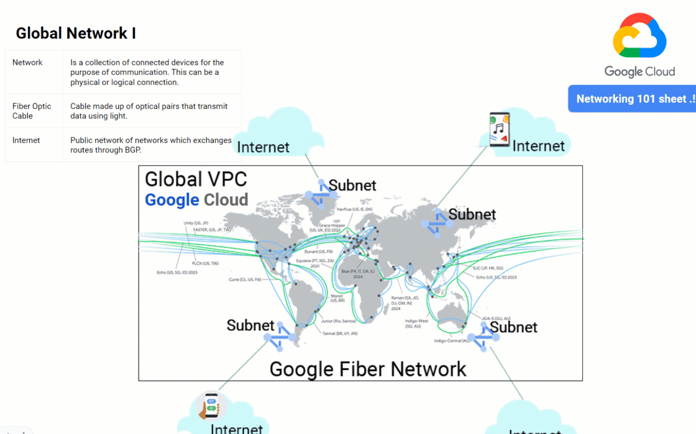

# The Networking 101 GCP sheet

It's easy to get lost in a converstaion around networking. I hope this referrence sheet can help with that.  

This is a quick 101 level reference guide of general networking terms and Google Cloud networking specific services.  

By the Developer Relations Engineer Ammett Williams of the Google Developer Relations Team.  

  

Download pdf version : 

[PDF](pdf/network101gcp.pdf)

For more about Google Cloud services check out the [Interactive Google Cloud Developer's Cheat Sheet](https://goo.gle/GCdevelopercheatsheet) 

----------------------------
# Contents
:link: - Link icon

### Global Network I & II

* **Network**: Is a collection of connected devices for the purpose of communication. This can be a physical or logical connection. 
* **Fiber Optic Cable**: Cable made up of optical pairs that transmit data using light. 
* **Internet**: Public network of networks which exchanges routes through BGP.
* **Region**: A Google Cloud geographic compute location (Made up of minimum 3 zones). [:link:](https://cloud.google.com/compute/docs/regions-zones#identifying_a_region_or_zone) 
* **Zone**: Google Cloud compute facility within a region. [:link:](https://cloud.google.com/compute/docs/regions-zones#identifying_a_region_or_zone) 
* **Point of presence (PoP)**: A connection point from the internet to Google’s network. [:link:](https://cloud.google.com/vpc/docs/edge-locations) 
* **On-premise**: Data center belonging to an enterprise. 
* **Local Area Network (LAN)**: This is a network that shares same communication lines in a distinct geographic area.
* **Virtual LAN (VLAN)**: A logical method to allow communication between systems that are located on different LAN segments.

### VPCs and IP addressing
  
* **Virtual private Cloud (VPC)**: VPC is a Logical representation of an on-prem network. This is a global construct in GCP. [:link:](hhttps://cloud.google.com/vpc/docs/vpc) 
* **VPC modes**: They are auto mode and custom mode. [:link: Auto mode](https://cloud.google.com/storage/docs/) [:link: Custom mode](https://cloud.google.com/storage/docs/)
* **VPC subnets**: These are regional and assigned to an IP address range. [:link:](https://cloud.google.com/vpc/docs/subnets) 
* **IP address**: A unique address used to identity host on network. Made up of network and host portions. [:link:](https://www.cisco.com/c/en/us/support/docs/ip/routing-information-protocol-rip/13788-3.html#anc5) 
* **Subnet mask**: This segments and IP address into network and host portions.  [:link:](https://www.cisco.com/c/en/us/support/docs/ip/routing-information-protocol-rip/13788-3.html#anc13) 
* **IPV4**: This is a 32 bit, 4 octet address. Written in binary or dotted decimal format. E.g. 192.168.10.20 or 11000000.10101000.00001010.00010100
* **IPV6**: This is a 128 bit, hexadecimal address. 2001:DB8:7654:3210:FEDC:BA98:764:3203
* **Private IP (RFC1918)**: A special range that can be used internally by anyone. These are non internet routable. [:link:](https://datatracker.ietf.org/doc/html/rfc1918) 
* **Public IP**: IP address that is routable on the internet  
* **Private IP (RFC1918)**: A special range that can be used internally by anyone. These are non internet routable. [:link:](https://datatracker.ietf.org/doc/html/rfc1918) 
* **DHCP**: Dynamic Host Control protocol. A method to automatically assign an IP address to a client. [:link:](https://datatracker.ietf.org/doc/html/rfc1918) 
* **Static IP**: An IP that does not change after being assigned. 
* **Ephemeral IP**: Temporary IP that is not reserved/static.  
* **Bring Your Own IP (BYOIP)**: Use external IP address that you own in Google Cloud  [:link:](https://cloud.google.com/vpc/docs/using-bring-your-own-ip)
* **Alias IP (RFC1918)**: Additional addresses that can be assigned to your VM, these can be taken from primary or secondary address range. [:link:](https://cloud.google.com/vpc/docs/alias-ip) 
* **Secondary IP**: Secondary range of IP address that can be assigned to your VM in GCP. 
* **Restricted.googleapis.com IP**: Used to access external GCP APIs via google private network. 199.36.153.4/30. Used when VPC service controls are enabled and you need to access only VPC service control supported APIs. [:link:](https://cloud.google.com/vpc/docs/configure-private-google-access) 
* **Private.googleapis.com IP**: Used to access external GCP APIs via google private network. 199.36.153.8/30 [:link:](https://cloud.google.com/vpc/docs/configure-private-google-access) 
    
### OSI model and Internet model
  
* **What is the OSI model**: A 7 layer conceptual model that provides interoperability of the TCP stack. [:link:](https://learningnetwork.cisco.com/s/article/osi-model-reference-chart) 
* **Application layer (layer 7)**: User interface and application. Protocols examples HTTP, HTML
* **Presentation layer (layer 6)**: Formats data to be presented. Protocols examples JPEG, ASCII, GIF 
* **Session layer (layer 5)**: Creates, tracks, ends the sessions between different systems. 
* **Transport layer (layer 4)**: Handles message delivery using connection and connectionless protocols. Protocol examples TCP, UDP.  
* **Network layer (layer 3)**: Focuses on subnets, route path selection. Protocols examples IP, ICMP,. Router work here.
* **Data layer (layer 2)**: Focuses of transferring data frames over physical layer. Protocol, ARP, PPP, VLANS. Switches work here.
* **Physical layer (layer 1)**: Transmission of raw bits over physical mediums. Examples network cables, wireless 
----
* **What is the internet model**: A 4 layer model conceptual model of the TCP/IP  stack.   
* **Application layer**: User interface and application. 
* **Transport layer**: Responsible for end to end data handling of data streams
* **Internet layer**: An IP that does not change after being assigned. 
* **Link layer**: Temporary IP that is not reserved/static.  

### TCP, TCP three-way handshake, UDP, QUIC
  
* **Transmission Control Protocol (TCP)**: This is a connection oriented protocol that handles reliability, flow and congestion control of packets. It establishes a connection before sending a packet. [:link:](https://datatracker.ietf.org/doc/html/rfc793) 
* **Transmission Control Block**: Contains all the information about the connection and implements the sliding window.
* **Sliding window**: Determines the amount of bytes that one system can send to the other. Once these byes are received by the receiver, The sender sends another set of bytes is sent until all data is sent.
* **Three-way handshake**: This is the sequence to form a TCP connection. It involve the SYN, SYN/ACK, ACK flag exchange between client/server. 
* **Flag**: These indicate the state of the connection. 
* **SYN**: The SYN or synchronize flag is sent to start the TCP connection process
* **ACK**: The ACK or the acknowledgement flag. This confirms that data was received. 
* **FIN**: A flag sent to request termination of connection.
* **User Datagram Protocol (UDP)**: This is a best effort delivery protocol.  
* **Quick UDP Internet Connections (QUIC)**: A Google made transport layer protocol. This is built on top of UDP.[:link:](https://peering.google.com/#/learn-more/quic) 
* **Transport Layer Security (TLS)**: A protocol that provides cryptography by using certificates. [:link:](https://en.wikipedia.org/wiki/Transport_Layer_Security) 

### Packet, Frame, MTU
  
* **Data messages types**: These are frames, packets, datagrams. They may exist at different layers of the OSI model.
* **Maximum transfer unit (MTU)**: The size of the largest unit of data that can be transmitted over the network.
* **Time to Live (TTL)**: This indicates the life of the packet usually has a max of 255 hops. This ensures packets don’t exist forever in a network.  
* **Unicast message**: These are sent on a 1 to 1 basis on a network.  
* **Multicast message**: These are sent to subscribed groups on a network. 
* **Broadcast message**: These are sent to every device on a network.  

### ARP, RARP, DNS & NAT
  
* **Domain Name Service (DNS)**: Resolves names to IP addresses.
* **Cloud DNS**: Google Cloud managed DNS offering. [:link:](https://cloud.google.com/dns/docs/overview/) 
* **DNS Security Extensions (DNSSEC)**: Uses digital signature to secure DNS information. [:link:](https://cloud.google.com/dns/docs/dnssec)  
* **Hybrid DNS**: DNS configured between cloud and on-prem or external networks  [:link:](https://cloud.google.com/dns/docs/best-practices#choose_where_dns_resolution_is_performed)  
* **Address resolution Protocol (ARP)**: Protocol used to resolve IP address to a MAC/link layer address. Maintained in the ARP table. [:link:](https://www.cisco.com/c/en/us/td/docs/ios-xml/ios/ipaddr_arp/configuration/15-s/arp-15-s-book/Configuring-Address-Resolution-Protocol.html#GUID-A7E9469A-187E-4811-BB1F-5013E13E1B6B) 
* **Reverse ARP (RARP)**: This is the inverse of ARP. Used to resolve MAC to IP addresses.
* **Media Access Control address (MAC)**: Unique hexadecimal identifier assigned to a network interface controller (NIC) card. Usually a 12 digit hexadecimal number.  [:link:](https://en.wikipedia.org/wiki/MAC_address)  
* **Network Address Translation (NAT)**: Allows private IP ranges to communicate with the internet. Maintains a NAT table of private to public address & port mappings for communications. 
* **Cloud NAT**: Google Cloud managed NAT service [:link:](https://cloud.google.com/nat/docs/overview)  

### Routing, Cloud Router, Dynamic Routing, BGP, MPLS
  
* **Routing**: Selecting a path for traffic to flow within internal networks or between different networks.
* **Router**: Allows communication between different networks.  
* **Cloud Router**: Google Cloud router that allow you to dynamically exchange routes between your VPC and on-prem using BGP. [:link:](https://cloud.google.com/network-connectivity/docs/router/concepts/overview)  
* **Routing table**: A repository of all the routing information within a network. 
* **Routing modes**: These are [static](https://en.wikipedia.org/wiki/Static_routing) or [dynamic](https://en.wikipedia.org/wiki/Dynamic_routing). 
* **Static routing**: These routes  are fixed an don’t update. They usually have to be manually adjusted.
* **Dynamic routing**: These routes update  to reflect current state. 
* **Route summarization**: Used to reduce the number of route advertised to neighbours. See example. [:link:](https://www.ciscopress.com/articles/article.asp?p=2995352)  
* **next-hop**: The address of the next router in the transit route of a packet. 
* **Software Defined networking**: A software based networking approach that uses application programming interfaces (API) to communicate with underlying infrastructure to control the network traffic. [:link:](https://en.wikipedia.org/wiki/Software-defined_networking)  
* **Border Gateway Protocol (BGP)**: Is the path vector protocol of the internet. Made up of Autonomous systems (AS) uses TCP port 179.  [:link:](https://datatracker.ietf.org/doc/html/rfc4271)  
* **Autonomous System (AS)**: Is a collection of connected Internet Protocol (IP) routing prefixes under the control of one or more network operators  
* **Autonomous System Number (ASN)**: A repository of all the routing information within a network. 
* **External BGP (eBGP)**: BGP connection formed between different AS’s. 
* **Internal BGP (iBGP)**: Connection formed within the same AS.
* **Multiple Exit Discriminator (MED)**: This a one of several BGP attributes used to influence paths election. This is non transitive and the lower metric wins. [:link:](https://datatracker.ietf.org/doc/html/rfc4271#section-5.1.4)  
* **AS-path prepend**: This is one of several BGP attributes used to influence paths election. This is mandatory. The shorter path should be preferred.[:link:](https://datatracker.ietf.org/doc/html/rfc4271#section-5.1.2)  
* **Multiprotocol label switching (MPLS)**: This is a switching method that uses labels instead of IP information to transmit packets across the backbone core at high speed. 
* **Bidirectional Forwarding Detection (BFD)**: This is a protocol that detects failure quickly on links when enabled. In GCP you can use this [feature](https://cloud.google.com/network-connectivity/docs/router/concepts/bfd) with Cloud router. 